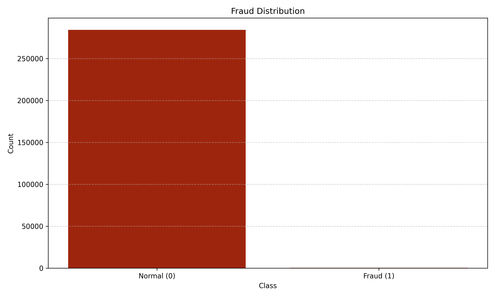
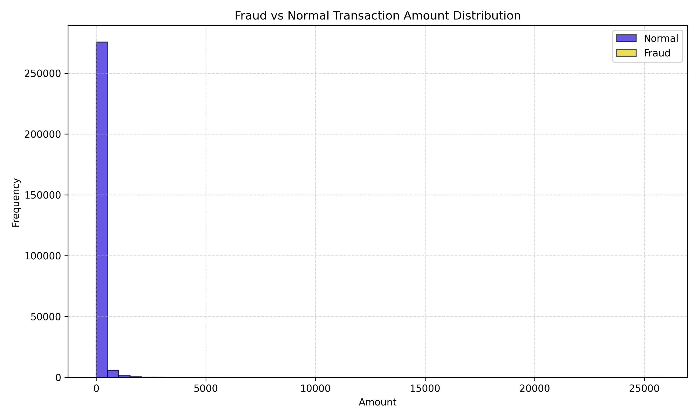
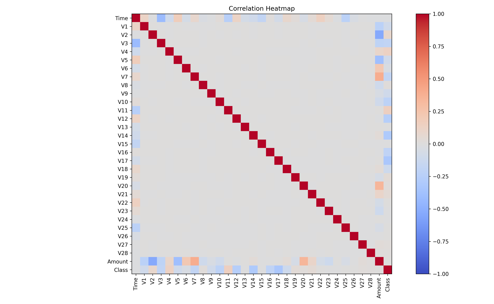
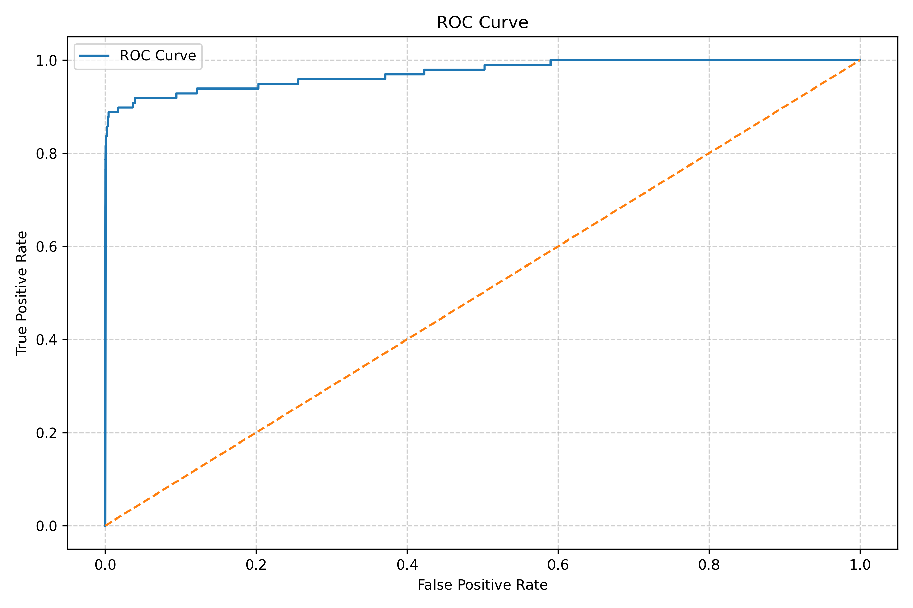
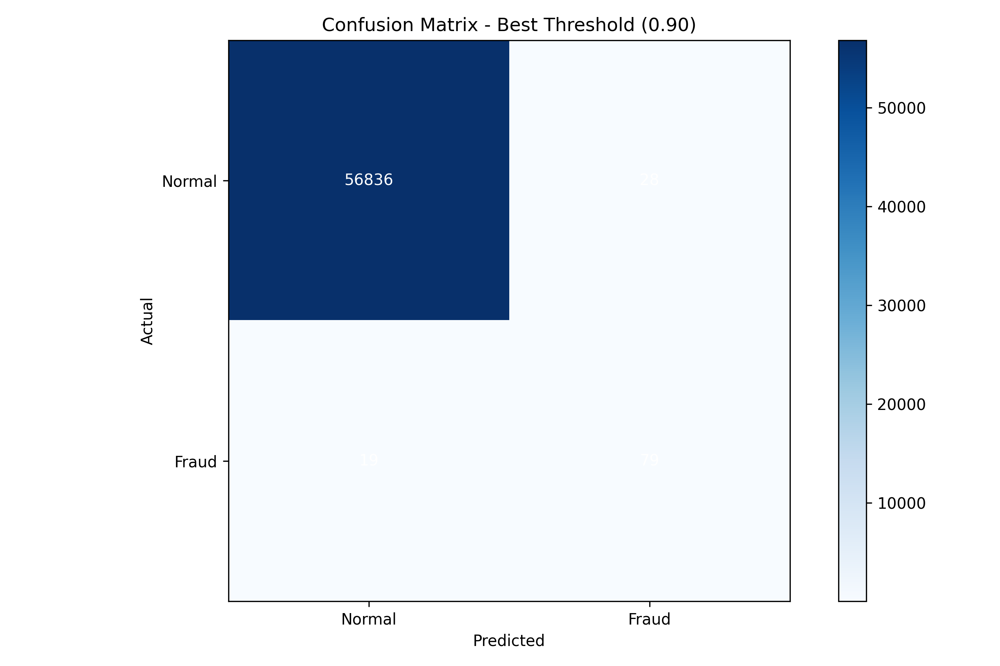

# 💳 AI Fraud Detection System


A machine learning system designed to detect fraudulent credit card transactions using a neural network model trained on highly imbalanced financial data.

The project demonstrates a full machine learning pipeline including:
- Data exploration
- Data preprocessing
- Handling extreme class imbalance
- Neural network training
- Model evaluation
- Threshold optimization
- Fraud risk scoring


## 🚨 Problem

> Credit card fraud detection is a highly imbalanced classification problem where fraudulent transactions represent only a tiny fraction of all transactions.

The goal of this project is to build a machine learning system capable of:
- Detecting fraudulent transactions
- Minimizing false positives
- Maximizing recall for fraud detection
- Producing a fraud risk score for each transaction


## 📊 Dataset

Dataset used:

**Credit Card Fraud Detection Dataset**

Source: [Kaggle - Credit Card Fraud Detection Dataset](https://www.kaggle.com/datasets/mlg-ulb/creditcardfraud)


**Dataset characteristics:**
| Feature                 | Value                 |
| ----------------------- | --------------------- |
| Total transactions      | 284,807               |
| Fraudulent transactions | 492                   |
| Fraud ratio             | 0.173%                |
| Features                | 30 numerical features |

Most variables are anonymized using **PCA transformation**.

**Important fields:**
- `Time`
- `Amount`
- `V1 – V28 (PCA features)`
- `Class`

**Where:**
- `0` → Normal transaction
- `1` → Fraudulent transaction


### Dataset Access

The dataset is not included in this repository because it exceeds GitHub’s file size limit.

Download it from Kaggle and place it inside the `data/` folder:

`data/creditcard.csv`


## 📊 Exploratory Data Analysis (EDA) & Model Evaluation
The project includes several visualizations to understand the dataset.

### Class Distribution



### Fraud vs Normal Transaction Amount



### Correlation Heatmap



### ROC Curve



### Confusion Matrix



## 🧠 Model
The project implements a complete ML pipeline:

### 1️⃣ Data Loading

Handles dataset loading and class distribution inspection.

### 2️⃣ Preprocessing

Includes:

- Train/Test split
- Feature scaling
- Handling imbalanced data


### 3️⃣ Model Training

A classification model is trained to detect fraudulent transactions.

The system evaluates:

- Precision
- Recall
- F1 Score
- ROC-AUC

### 4️⃣ Threshold Optimization

Instead of using the default threshold (0.5), multiple thresholds are tested to find the best balance between:

| Threshold | Precision | Recall | F1       |
| --------- | --------- | ------ | -------- |
| 0.10      | 0.37      | 0.84   | 0.51     |
| 0.50      | 0.55      | 0.82   | 0.66     |
| 0.90      | 0.73      | 0.81   | **0.77** |


### Best Threshold:

`Threshold: 0.90`
`Best F1 Score: 0.7707`


## 📈 Results

Final model performance:
| Metric    | Score |
| --------- | ----- |
| Precision | 0.738 |
| Recall    | 0.806 |
| F1 Score  | 0.770 |
| ROC-AUC   | 0.958 |

**Interpretation**

- The model detects 80% of fraudulent transactions

- Maintains reasonable precision to reduce false alerts

- Demonstrates strong separation capability (ROC-AUC = 0.958)


## 📁 Project Structure

```
fraud-ai-system/
│
├── data/
│   └── creditcard.csv
│
├── src/
│   ├── data_loader.py
│   ├── preprocessing.py
│   ├── visualization.py
│   ├── model.py
│   ├── trainer.py
│   └── evaluator.py
│
├── utils/
│   └── metrics.py
│
├── assets/
│   ├── eda/
│   └── model/
│
├── main.py
├── requirements.txt
└── README.md
```


## ⚙️ Installation
Clone the repository:

```bash
git clone https://github.com/caglaeren/fraud-ai-system.git
cd fraud-ai-system
```

**Install dependencies:**
```bash
pip install -r requirements.txt
```

## ▶️ Run the Project

Run the full pipeline:

```bash
python main.py
```

**The system will:**
- Load the dataset
- Train the model
- Evaluate performance
- Generate visualizations


## 🧠 Key Takeaways

- Fraud detection is a highly imbalanced classification problem
- Accuracy alone is not meaningful
- Precision and recall must be balanced
- Threshold optimization significantly improves performance


## 👤 Author:

**Tuğba Çağla EREN**