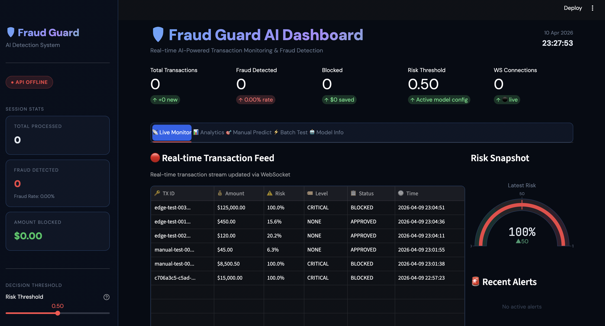
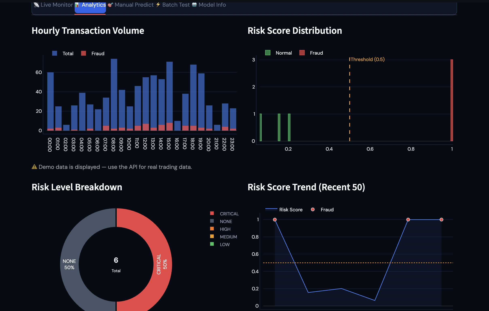
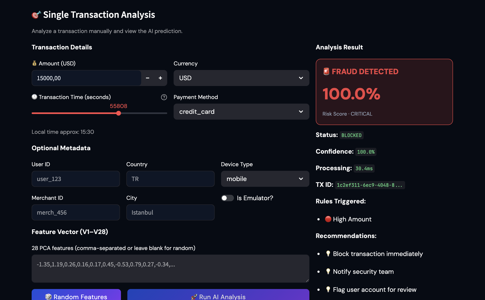

# 💳 AI Fraud Detection System - Version 2.0


## 🌍 Documentation

---
Choose your preferred language:

🇬🇧 English: [README.md](README.md)  
🇹🇷 Turkish: [tr.md](tr.md) 

---

## 🚀 New Features & Updates

### 🖥️ Interactive AI Dashboard
A professional-grade real-time monitoring interface built with **Streamlit**.
- **Live Transaction Feed:** Real-time monitoring of incoming transactions via WebSockets.
- **Dynamic Risk Scoring:** Instant visualization of fraud probability (0.0% - 100.0%) for each transaction.
- **Custom Dark Theme:** Modern UI designed for high-performance financial monitoring.
- **Decision Control:** Adjustable risk thresholds and display options (Auto-refresh, Alerts) directly from the sidebar.
- **Status Monitoring:** Real-time tracking of API connectivity and Model loading status.


### 🔌 RESTful API Integration
Powered by a high-performance **FastAPI** backend.
- **Scalable Architecture:** Separate API layer for seamless integration.
- **Real-time Inference:** Model predictions served via optimized endpoints.
- **Auto-Documentation:** Interactive API docs (Swagger) included.

### ⚡ High-Performance Caching
Optimized with **Redis** for ultra-low latency and scalable data management.
- **Latency Optimization:** Achieved ~50ms end-to-end response times by caching frequent model inferences.
- **Efficient Data Handling:** Reduced system overhead by offloading real-time transaction metadata to memory.
- **Scalable Architecture:** Designed to handle high-concurrency traffic during peak financial activity.

---

### 📸 Dashboard Preview

The interface is divided into four specialized modules for comprehensive fraud management:

* 📊 **Dashboard** — Real-time system statistics, live transaction feed, and global risk metrics.
* 🎯 **Prediction** — Manual deep-dive tool for single transaction risk scoring and AI recommendations.
* 🧠 **Model Info** — Detailed breakdown of neural network architecture, training configurations, and performance metrics.
* ⚙️ **Settings** — Real-time decision control including risk threshold adjustments and export options.


#### 1️⃣ Real-time Monitoring & Live Feed

*Central hub displaying total transactions, blocked amounts, and a live stream with detailed risk levels (CRITICAL, MEDIUM, NONE).*

#### 2️⃣ Advanced Analytics & Risk Trends

*Visual breakdown of risk score distributions and real-time risk trends over the last 50 transactions.*

#### 3️⃣ Single Transaction Analysis (Manual Predict)

*Deep-dive tool for manual testing. Provides instant analysis results, confidence scores, and specific actionable recommendations (e.g., "Notify security team").*


---

A machine learning system designed to detect fraudulent credit card transactions using a neural network model trained on highly imbalanced financial data.

The project demonstrates a full machine learning pipeline including:
- Data exploration
- Data preprocessing
- Handling extreme class imbalance
- Neural network training
- Model evaluation
- Threshold optimization
- Fraud risk scoring


## 🚨 Problem

> Credit card fraud detection is a highly imbalanced classification problem where fraudulent transactions represent only a tiny fraction of all transactions.

The goal of this project is to build a machine learning system capable of:
- Detecting fraudulent transactions with high precision.
- Minimizing false positives to reduce user friction.
- Maximizing recall for fraud detection.


## 📊 Dataset

Dataset used:

**Credit Card Fraud Detection Dataset**

Source: [Kaggle - Credit Card Fraud Detection Dataset](https://www.kaggle.com/datasets/mlg-ulb/creditcardfraud)


**Dataset characteristics:**
| Feature                 | Value                 |
| ----------------------- | --------------------- |
| Total transactions      | 284,807               |
| Fraudulent transactions | 492                   |
| Fraud ratio             | 0.173%                |
| Features                | 30 numerical features |

Most variables are anonymized using **PCA transformation**.

**Important fields:**
- `Time`
- `Amount`
- `V1 – V28 (PCA features)`
- `Class`

**Where:**
- `0` → Normal transaction
- `1` → Fraudulent transaction


### Dataset Access

The dataset is not included in this repository because it exceeds GitHub’s file size limit.

Download it from Kaggle and place it inside the `data/` folder:

`data/creditcard.csv`


## 📊 Exploratory Data Analysis (EDA) & Model Evaluation
The project includes several visualizations to understand the dataset.

### Class Distribution


### Fraud vs Normal Transaction Amount


### Correlation Heatmap


### ROC Curve


### Confusion Matrix


## 🧠 Model
The project implements a complete ML pipeline:

### 1️⃣ Data Loading

Handles dataset loading and class distribution inspection.

### 2️⃣ Preprocessing

Includes:

- Train/Test split
- Feature scaling
- Handling imbalanced data


### 3️⃣ Model Training

A classification model is trained to detect fraudulent transactions.

The system evaluates:

- Precision
- Recall
- F1 Score
- ROC-AUC

### 4️⃣ Threshold Optimization

Instead of using the default threshold (0.5), multiple thresholds are tested to find the best balance between:

| Threshold | Precision | Recall | F1       |
| --------- | --------- | ------ | -------- |
| 0.10      | 0.37      | 0.84   | 0.51     |
| 0.50      | 0.55      | 0.82   | 0.66     |
| 0.90      | 0.73      | 0.81   | **0.77** |


### Best Threshold:

`Threshold: 0.90`
`Best F1 Score: 0.7707`


## 📈 Results

Final model performance:
| Metric    | Score |
| --------- | ----- |
| Precision | 0.738 |
| Recall    | 0.806 |
| F1 Score  | 0.770 |
| ROC-AUC   | 0.958 |

**Interpretation**

- The model detects 80% of fraudulent transactions

- Maintains reasonable precision to reduce false alerts

- Demonstrates strong separation capability (ROC-AUC = 0.958)


## 📁 Project Structure

```
fraud-ai-system/
│
├── api/                # FastAPI backend services
│   └── main.py         # API entry point & endpoints
│
├── dashboard/          # Streamlit UI components
│   └── styles.py       # Custom CSS & layout configurations
│
├── data/               # Project datasets
│   └── creditcard.csv  # Raw data (Ignored by Git)
│
├── src/                # Core ML pipeline
│   ├── data_loader.py  # Data ingestion
│   ├── preprocessing.py# Cleaning & scaling
│   ├── visualization.py# Plotting functions
│   ├── model.py        # ANN architecture
│   ├── trainer.py      # Training logic
│   └── evaluator.py    # Performance analysis
│
├── models/             # Saved model artifacts
│   └── fraud_model.h5  # Trained Neural Network weights
│
├── utils/              # Helper functions
│   └── metrics.py      # Custom scoring logic
│
├── assets/             # Visual documentation
│   ├── eda/            # Exploratory plots
│   ├── model/          # Confusion matrix, ROC curves
│   └── dashboard/      # UI screenshots
│
├── main.py             # Full pipeline orchestrator
├── dashboard.py        # Streamlit dashboard runner
├── requirements.txt    # Project dependencies
└── README.md           # Project documentation
```


## ⚙️ Installation
Clone the repository:

1. **Clone the repository:**
```bash
   git clone [https://github.com/caglaeren/fraud-ai-system.git](https://github.com/caglaeren/fraud-ai-system.git)
   cd fraud-ai-system
```

2. **Create and activate a virtual environment (Optional but Recommended):**
```bash
python -m venv venv
source venv/bin/activate  # On Windows: venv\Scripts\activate
```

3. **Install dependencies:**
```bash
pip install -r requirements.txt
```

## ▶️ Run the Project

1. **Run the full pipeline:**

```bash
python main.py
```

2. **Start the Backend API (FastAPI)**
To serve the model for real-time predictions:
```bash
uvicorn api.main:app --reload
```

Once started, you can access the API documentation at: http://127.0.0.1:8000/docs

3. **Launch the AI Dashboard (Streamlit)**
```bash
streamlit run dashboard.py
```

## 🔌 API Endpoints (FastAPI)

| Endpoint | Method | Description |
|----------|--------|-------------|
| `/health` | GET | System health check |
| `/predict` | POST | Single transaction risk prediction |
| `/predict/batch` | POST | Batch prediction (max 100) |
| `/model/info` | GET | Model architecture & metadata |

**Sample Prediction Request:**
```json
POST /predict
{
  "transaction_id": "TXN-784512",
  "amount": 125.50,
  "currency": "USD",
  "time": 43200,
  "v_features": [0.1, -0.2, 0.3, ..., 0.05], // 28 PCA features
  "user_id": "USER-99",
  "merchant_id": "MERCH-404",
  "location": {
    "country": "Turkey",
    "city": "Ankara",
    "ip_address": "192.168.1.1"
  },
  "device": {
    "device_type": "Mobile",
    "os": "iOS",
    "is_emulator": false
  },
  "payment_method": "Credit Card"
}
```
**Response**
```json
{
 "transaction_id": "TXN-784512",
  "risk_score": 0.0395,
  "risk_level": "none",
  "is_fraud": false,
  "confidence": 1.0,
  "threshold": 0.5,
  "model_version": "v5.0.0",
  "timestamp": "2026-04-11T00:41:09.955Z",
  "status": "approved",
  "processing_time_ms": 54.54,
  "rules_triggered": [],
  "recommendations": ["Process normally"]
}
```

## 🔧 Configuration (`config.yaml`)

The system is fully customizable via a centralized `config.yaml` file. This allows you to tune hyperparameters and system behavior without touching the code:

```yaml
# Model Architecture
model:
  hidden_layers: [128, 64, 32, 16]
  dropout_rate: 0.3
  use_batch_norm: true
  activation: "relu"

# Training Strategy
training:
  epochs: 50
  batch_size: 2048
  learning_rate: 0.001
  early_stopping:
    enabled: true
    patience: 5
  learning_rate_scheduler:
    enabled: true
    factor: 0.5

# Advanced Sampling & Evaluation
sampling:
  method: "smote" # Options: oversample, undersample, smote

evaluation:
  default_threshold: 0.5
  threshold_range: [0.1, 0.9]

checkpoint:
  save_dir: "models/"
  monitor: "val_f1_score"
```

## 🧠 System Workflow
When you run the complete system:
1. **Data Ingestion & Analysis:** Automatically fetches the dataset and performs deep EDA.
2. **Smart Preprocessing:** Handles feature scaling and addresses imbalance using SMOTE.
3. **Neural Network Training:** Orchestrates a Deep ANN with Dropout and Batch Normalization.
4. **Real-time Decision Engine:** Categorizes transactions based on the `risk_score`:
5. **Deployment & Optimization:** The **FastAPI** backend serves inferences using **Redis** for high-speed caching, achieving ultra-low latency (~50ms). Meanwhile, the **Streamlit Dashboard** visualizes live traffic with proactive security alerts.

| Risk Level | API Status | Action Taken |
| :--- | :--- | :--- |
| 🔴 **CRITICAL** | `blocked` | High-risk detected. Transaction is automatically **Rejected**. |
| 🟡 **MEDIUM** | `flagged` | Suspicious pattern. Sent for **Manual Review** & extra verification. |
| 🟢 **NONE** | `approved` | Low-risk verified. Transaction is processed **Seamlessly**. |


## 🧠 Key Takeaways

- Fraud detection is a highly imbalanced classification problem
- Accuracy alone is not meaningful
- Precision and recall must be balanced
- Threshold optimization significantly improves performance


## 👥 Authors & Contributors

This project is developed and maintained by:

| Name | Role | Profile |
| :--- | :--- | :--- |
| **Tuğba Çağla EREN** | Project Lead & AI Engineer | [@caglaeren](https://github.com/caglaeren) |
| **Zendi** | Contributor | [@zenndi](https://github.com/zenndi) |

---

## 📩 Contact & Support

If you have any questions, feel free to reach out:
- **LinkedIn:** [Tuğba Çağla EREN](https://www.linkedin.com/in/cagla-eren/)
- **Project Link:** [https://github.com/caglaeren/fraud-ai-system](https://github.com/caglaeren/fraud-ai-system)

---

> This project was developed as part of a comprehensive study on deep learning applications in financial security.